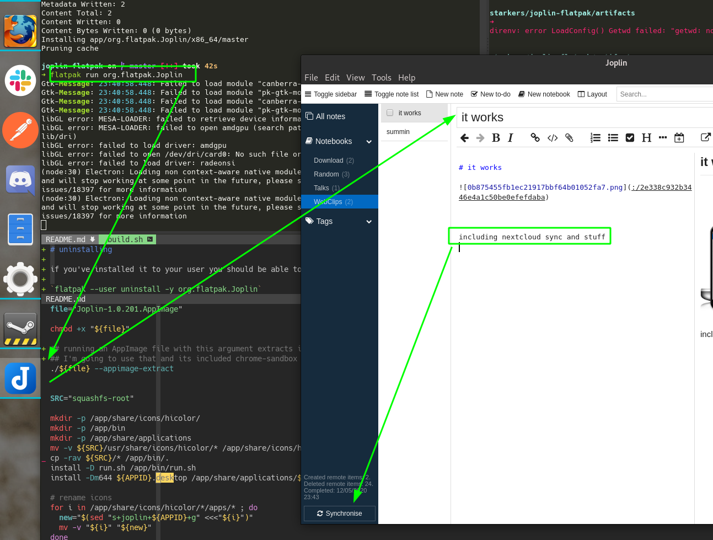

This is a generic experiment to scratch one of my itches..

1. learn some flatpak
2. gain a version of Joplin that can be consistent on all my computers.





# How to use this

Right now this is not published anywhere (like flathub) but you should be able to "create" the flatpak and install it locally.


Simply running this should work

```
flatpak-builder --force-clean build-dir org.flatpak.Joplin.yaml --install --user
```

Note the `--user` flag will install it locally after building it.

Afterwards you should be able to run it so:

`flatpak run org.flatpak.Joplin`


## eratta

I assume you've already setup the flathub repo..

you may also need to install the Sdk:

`flatpak install flathub org.freedesktop.Platform//19.08 org.freedesktop.Sdk//19.08 org.electronjs.Electron2.BaseApp//19.08`

for help, please read the flatpak docs/some tutorials..

# uninstalling

if you've installed it to your user you should be able to uninstall it

`flatpak --user uninstall -y org.flatpak.Joplin`
